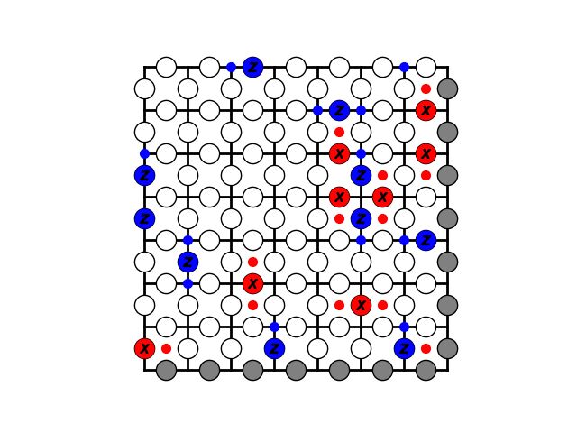
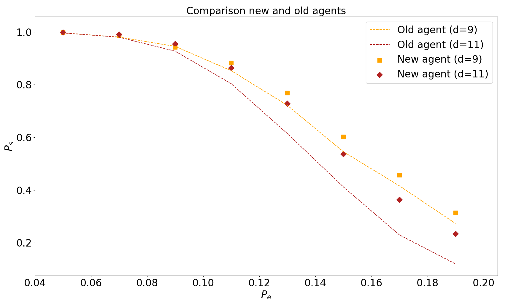

# Deep Q-learning decoder trained using MCTS 
This is a continuation on the work done in my [bachelor thesis](https://odr.chalmers.se/bitstream/20.500.12380/300901/1/TIFX04-20-73%2c%20kandidatrapport.pdf) and an attempt to improve performence of the trained artificial neural networks.  

## Background
Down bellow a successful error correction on a toric code of size d=7 is illustrated. The X,Y, and Z errors are also shown along with their resulting plaquette and vertex defects (the small dots). The goal of the decoder is to eliminate all the defects on the toric code by applying Pauli operators X,Y or Z without causing a non-trivial chain of errors (chain which span over the entire toric code). The input for the decoder is however only the toric code with visible defects, making the error correction a difficult problem to solve. More detail regarding this is found in the bachelor thesis or in the paper by [Fitzek et. al ](https://arxiv.org/pdf/1912.12919.pdf). 

## Results so far
I have managed to improve performence on the decoders for size d=9 and d=11. In the graph below a comparison is made between the old agents from the bachelor thesis and the newly improved. Here Ps reperesents the success rate of the decoder, in other words how often it managed to eliminate all the defects without causing a non trivial loop. The rate of error Pe is the probability of an error occuring in a specific place on the toric code and Pe/3 = px = py = pz. As we see the new version outperformence the old version. The reason is that the old version did not allways succeed in eliminating all the defects but this version does, except for d=11 at values of Pe > 0.09.

 
### Installation 
- The libraries necessary are matplotlib, numpy and pytorch

## How to use this repository
There are three example scripts
- train_script.py
- prediction_script_network.py
- prediction_script_MCTS.py

train_script trains an agent to solve a syndrom (as a decoder). All hyperparameters are set in this script and an evaluation of the training is saved in a txt file under the data folder.

prediction_script_network uses a trained agent to solve a syndrom.

prediction_script_MCTS uses a trained agent to guide treesearch which in turns determines the moves to make in order to solve the syndrom. 
